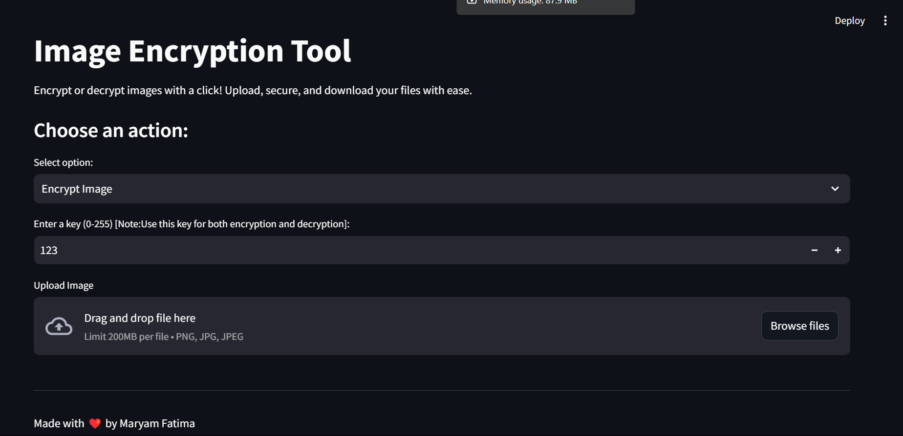
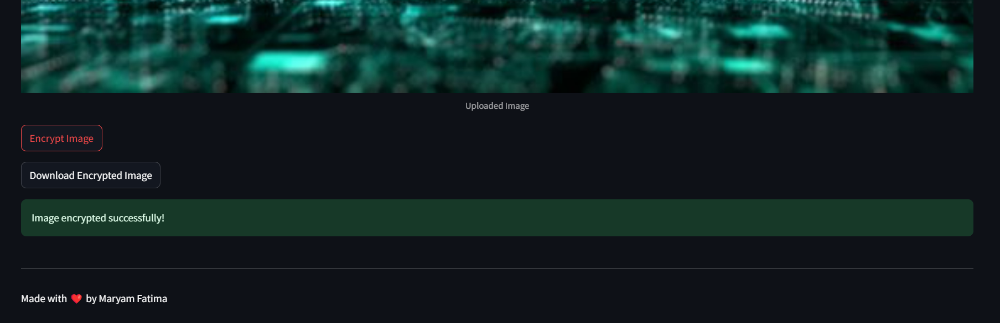
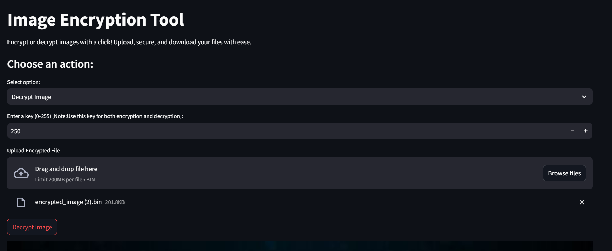

# Image Encryption Tool

A simple GUI application for XOR encryption and decryption of images. Built with Streamlit and Python.

## Features

- **Image Encryption & Decryption**: XOR-based encryption for images.
- **Simple Key Input**: Enter a key (0-255) for both encryption and decryption.
- **Download & Upload**: Save encrypted files and decrypt them later.

## Screenshots

<p align="center">
  
  <br/><i>Image Encryption user window</i>
</p>

<p align="center">
  
  <br/><i>Encrypt the image with the chosen key.</i>
</p>

<p align="center">
  
  <br/><i>Decrypt the image with the same key used for encryption.</i>
</p>

## Installation

1. **Clone the Repository**:
    ```sh
    git clone https://github.com/MaryamFatima16/Image-Encryption-Tool.git
    cd Image-Encryption-Tool
    ```

2. **Install Required Packages**:
    Make sure you have Python 3.6 or above installed. Then, install the required Python packages:
    ```sh
    pip install streamlit pillow
    ```

3. **Run the Application**:
    Launch the application with:
    ```sh
    streamlit run image-encryption-tool.py
    ```

## Usage

1. **Select Action**: Choose "Encrypt Image" or "Decrypt Image" from the dropdown menu.
2. **Upload File**:
    - For encryption: Upload an image file (PNG, JPG, JPEG).
    - For decryption: Upload the encrypted binary file.
3. **Enter Key**: Input a key between 0 and 255. Use the same key for both encryption and decryption.
4. **Perform Action**:
    - Click "Encrypt Image" to generate an encrypted file.
    - Click "Decrypt Image" to restore the original image from the encrypted file.
5. **Download/Save**: Download the encrypted image or view the decrypted result.

## Encryption Details

- **Encryption Method**: XOR with a key (0-255).
- **Key Management**: The same key must be used for both encryption and decryption.

## Notes

- **Key Range**: The key must be an integer between 0 and 255.
- **File Format**: Encrypted images are saved as binary files (.bin).

## License

This project is licensed under the MIT License - see the [LICENSE](LICENSE) file for details.
